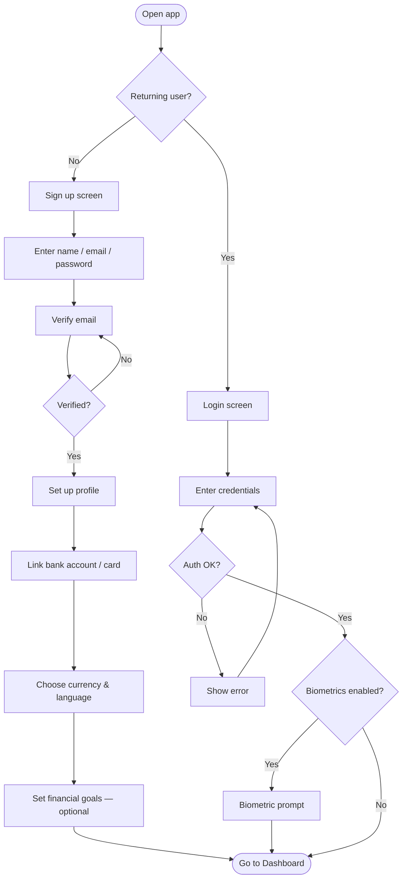
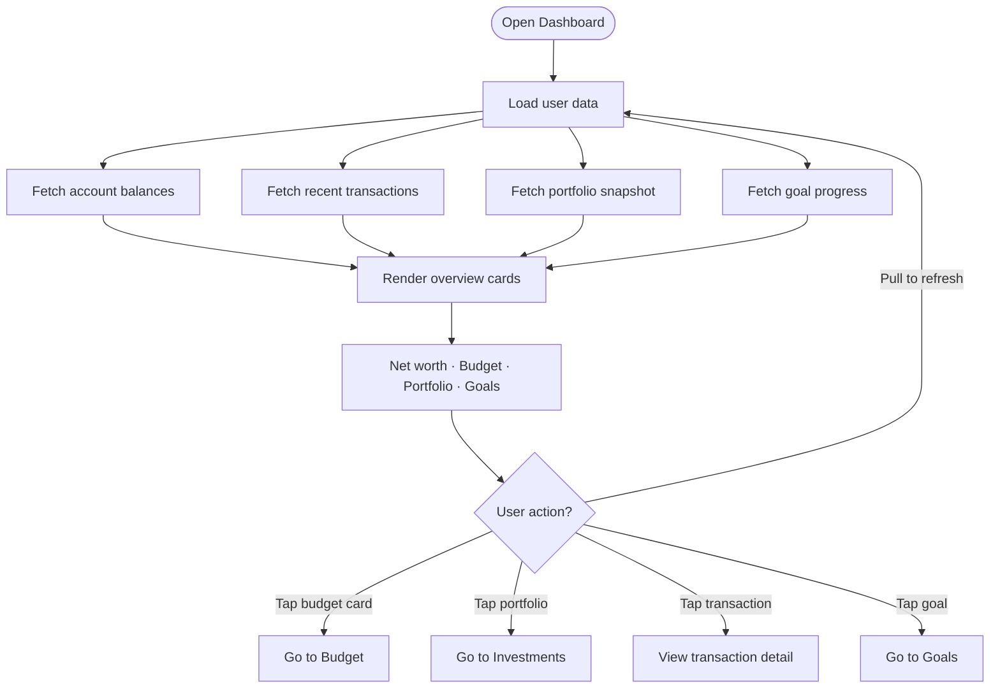
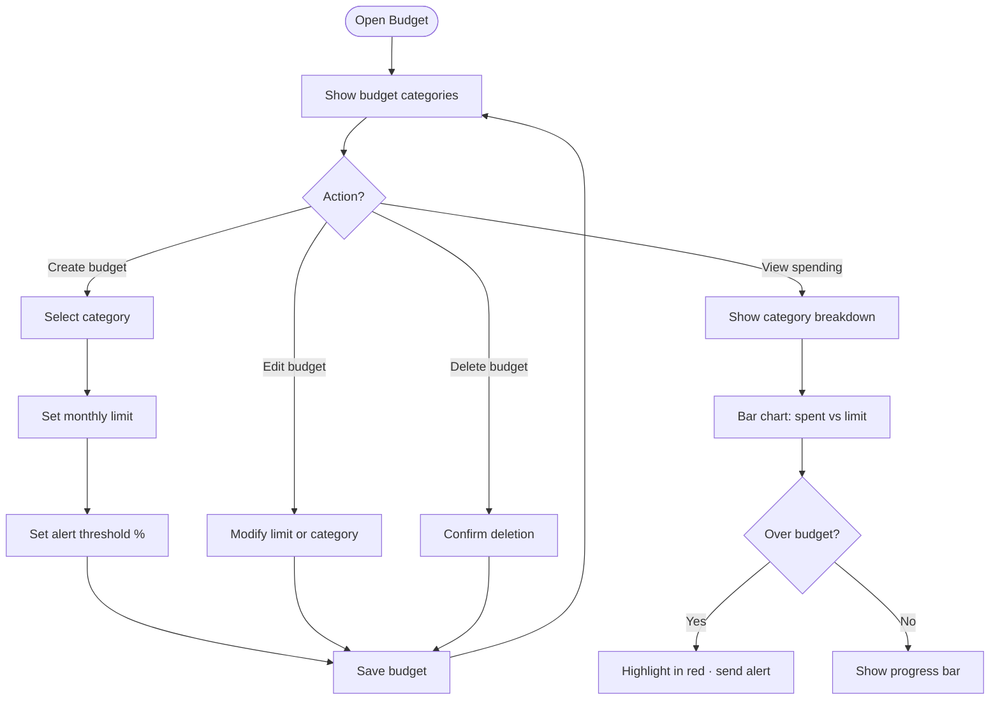
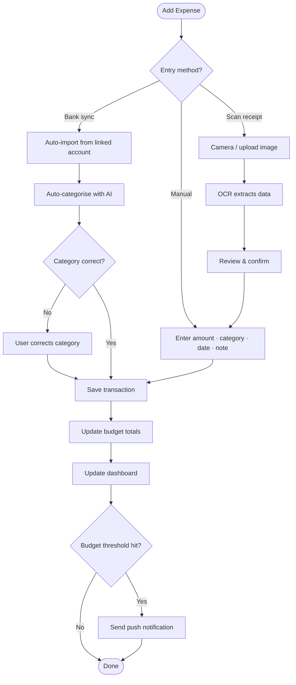
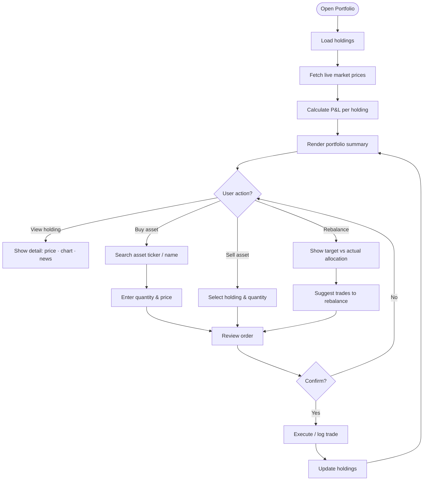
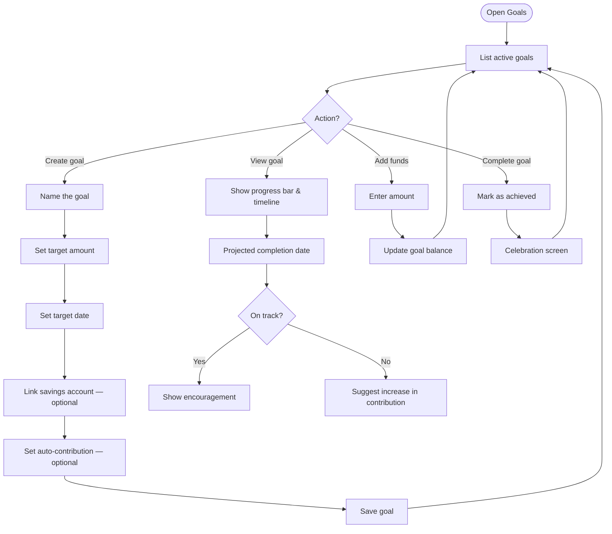
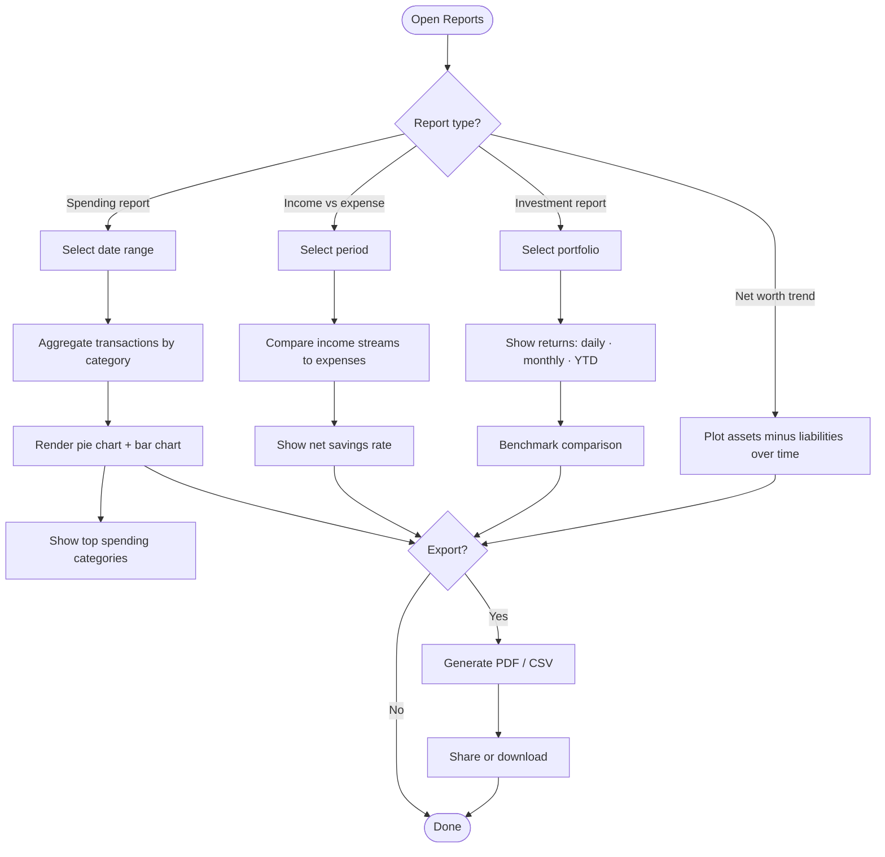
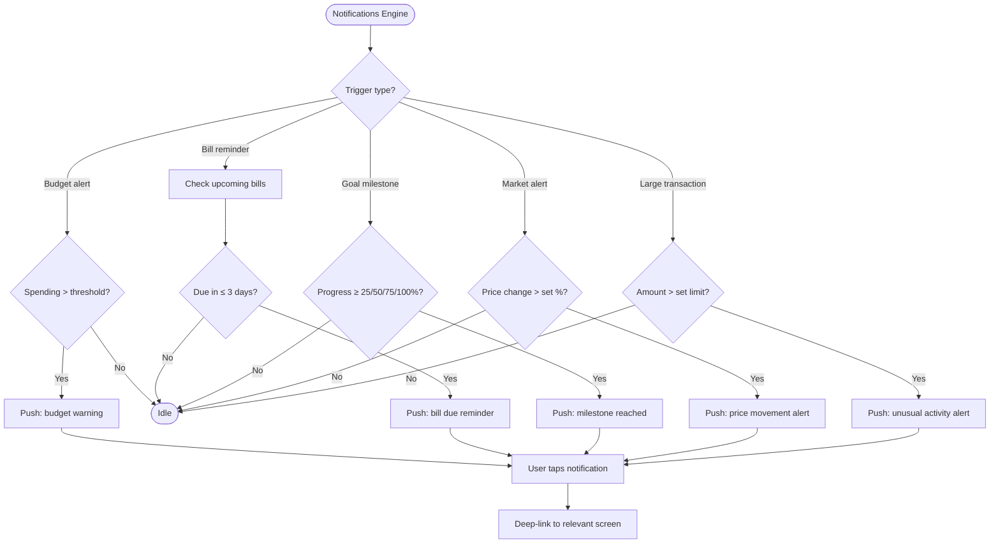

# Finance Management & Investing App — Feature Flowcharts

---

## 1. Onboarding & Authentication

---

## 2. Dashboard & Overview

---

## 3. Budget Management

---

## 4. Expense Tracking

---

## 5. Investment Portfolio

---

## 6. Goals & Savings

---

## 7. Reports & Analytics

---

## 8. Notifications & Alerts

